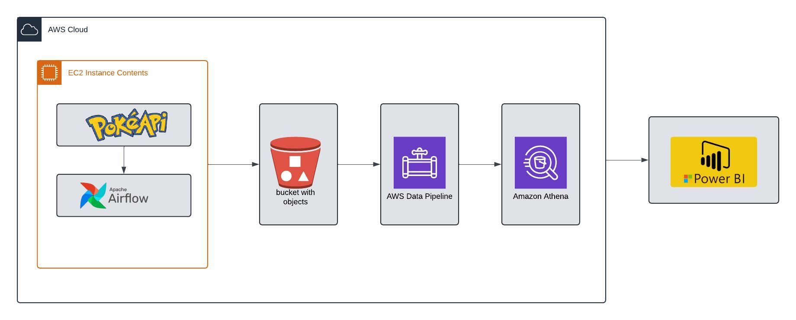

# 🔴⚪ Pokemon Analytics - AWS Cloud Platform

## Introduction
This project focuses on analyzing Pokémon data using a range of cloud-based technologies within the AWS ecosystem. The primary goal is to extract meaningful insights from a dataset derived from the Pokémon API. The analysis is conducted using a combination of Amazon S3 for data storage, Amazon Athena for querying data, Apache Spark for distributed data processing, and Apache Airflow for orchestrating the workflow. Finally, the results are visualized and presented through an interactive dashboard built in Power BI. This approach leverages the scalability and flexibility of AWS services to efficiently handle and analyze the dataset, providing a comprehensive view of the Pokémon data.

## Architecture

## Technology Used
1. Programming Language: Python
2. Cloud: AWS
   - EC2 compute instance
   - Amazon S3 bucket
   - Amazon Athena
3. Apache Airflow
4. Microsoft Power BI

## Dataset
The dataset consists of two datasets from the PokemonAPI website:
1. Pokemon dataset, where I selected only the first generation pokemon for analysis
2. Berries dataset, contains all berries.

## The pokemon dataset contains information on pokemon such as:

> id -The identifier for this resource. (integer)

> name - The name for this resource. (string)

> base_experience	- The base experience gained for defeating this Pokémon. (integer)

> height - The height of this Pokémon in decimetres. (integer)

> is_default	Set for exactly one Pokémon used as the default for each species. (boolean)

> order	- Order for sorting. Almost national order, except families are grouped together. (integer)

> weight - The weight of this Pokémon in hectograms. (integer)

above information referenced from pokemon api: https://pokeapi.co/docs/v2#pokemon

 I appended the pokemon's types post api request 

type 1 - pokemon's base or primary type. (string)

type 2 - pokemon's second type if it has one. could be empty/null. (string)

## Berries dataset information

id	- The identifier for this resource. (integer)

name	- The name for this resource. (string)

growth_time	- Time it takes the tree to grow one stage, in hours. Berry trees go through four of these growth stages before they can be picked. (integer)

max_harvest - The maximum number of these berries that can grow on one tree in Generation IV. (integer)

natural_gift_power - The power of the move "Natural Gift" when used with this Berry. (integer)

size - The size of this Berry, in millimeters. (integer)

smoothness - The smoothness of this Berry, used in making Pokéblocks or Poffins. (integer)

soil_dryness - The speed at which this Berry dries out the soil as it grows. A higher rate means the soil dries more quickly. (integer)

above information references pokemon api: https://pokeapi.co/docs/v2#berries-section

This data will be analyzed to extract insights about first generation pokemon as well as berries in the pokemon world such as, pokemon weights, heights, types and berry data such as smoothness, size, growth_time etc. Apache Airflow will be used for workflow management,AWS Cloud Platform technologies for data storage and processing and lastly vizualisation using Power BI.

datasets - can be found using the apis at: https://pokeapi.co/

Report - [Pdf Power Bi report](pokedata.pdf)

